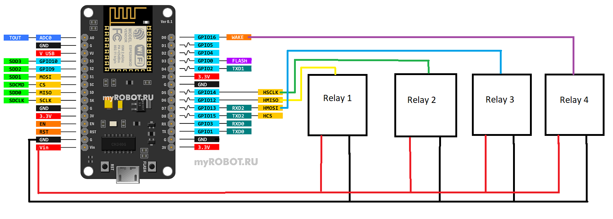

# Монитор температуры на основе Blynk и nodeMCU

## Ссылки

[https://www.blynk.cc](http://www.blynk.cc)

[https://docs.blynk.cc/](https://docs.blynk.cc/)

[https://examples.blynk.cc/](https://examples.blynk.cc/)

## Версии использованные при сборке проекта

Файлы лежат в папке [./docs](./docs)

- Blynk мобильный клиент v2.27.24
- Blynk сервер v0.41.17
- Blynk ардуино библиотека v0.6.1

## Таблица виртуальных пинов

| Название                        | Виртуальный пин |
| ------------------------------- | :-------------: |
| переключатель для реле 1        |       V1        |
| переключатель для реле 2        |       V2        |
| температура с датчика DS18B20 1 |       V3        |
| температура с датчика DS18B20 2 |       V4        |
| температура с датчика DHT11     |       V5        |
| влажность с датчика DHT11       |       V5        |

## Распиновка платы nodeMCU

## Схема подключения датчиков

## Схема подключения реле

