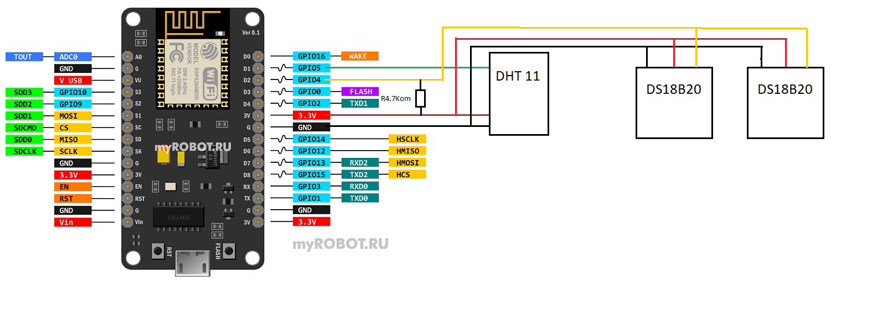

# Мониторинг температуры на основе Blynk и nodeMCU


## Ссылки

[https://www.blynk.cc](http://www.blynk.cc)

[https://docs.blynk.cc/](https://docs.blynk.cc/)

[https://examples.blynk.cc/](https://examples.blynk.cc/)

## Версии использованные при сборке проекта

Файлы лежат в папке [docs](./docs) взяты с сайта [4pda.to](https://4pda.to/forum/index.php?showtopic=818763)

-   Blynk мобильный клиент v2.27.24
-   Blynk сервер v0.41.17
-   Blynk ардуино библиотека v0.6.1

Проект PlatformIO создан для платы `NodeMCU 1.0 (ESP-12E Module)`

Перед сборкой:
1. скопировать папку Blynk из `docs\to_libdeps.7z` в папку `.pio\libdeps\nodemcuv2`
2. в конце файла `.pio\libdeps\nodemcuv2\Blynk\src\BlynkSimpleEsp8266.h` заменить строку `BlynkWifi Blynk(_blynkTransport);` на `extern BlynkWifi Blynk;` чтобы избавиться от ошибки `src\main.cpp:47:11: error: redefinition of 'BlynkWifi Blynk'` [link](https://arduino.stackexchange.com/questions/58358/how-to-avoid-multiple-definition-of-blynk-error)

## Таблица виртуальных пинов

| Название                                                     | Виртуальный пин |
| ------------------------------------------------------------ | :-------------: |
| температура с датчика DS18B20 #1                             |       V1        |
| переключатель (вкл/выкл) контроля по температуре для реле #1 |       V2        |
| целевая температура для реле #1                              |       V3        |
| гистерезис для реле #1                                       |       V4        |
| светодиод состояния пина для реле #1                         |       V5        |
| светодиод состояния ошибки для реле #1                       |       V30       |
| -                                                            |        -        |
| температура с датчика DS18B20 #2                             |       V6        |
| переключатель (вкл/выкл) контроля по температуре для реле #2 |       V7        |
| целевая температура для реле #2                              |       V8        |
| гистерезис для реле #2                                       |       V9        |
| светодиод состояния пина для реле #2                         |       V10       |
| светодиод состояния ошибки для реле #2                       |       V31       |
| -                                                            |        -        |
| температура с датчика DHT11                                  |       V20       |
| влажность с датчика DHT11                                    |       V21       |
| -                                                            |        -        |
| переключатель (вкл/выкл) реле #3                             |       V25       |
| переключатель (вкл/выкл) реле #4                             |       V26       |

## Распиновка платы nodeMCU


## Схема подключения датчиков



## Схема подключения реле


## Фото собранной платы


## Ток потребления со всеми включенными реле


## Ошибка при записи прошивки в Lolin NodeMCU v3

Помогает установка драйверов для чипа CH340

- [https://stackoverflow.com/questions/76146837/a-fatal-esptool-py-error-occurred-cannot-configure-port-permissionerror13-a]()
- [https://sparks.gogo.co.nz/ch340.html]()


```
Configuring upload protocol...
AVAILABLE: espota, esptool
CURRENT: upload_protocol = esptool
Looking for upload port...
Auto-detected: COM3
Uploading .pio\build\nodemcuv2\firmware.bin
esptool.py v3.0
Traceback (most recent call last):
Serial port COM3
  File "C:\Users\Maxi\.platformio\packages\tool-esptoolpy\esptool.py", line 3969, in <module>
    _main()
  File "C:\Users\Maxi\.platformio\packages\tool-esptoolpy\esptool.py", line 3962, in _main
    main()
  File "C:\Users\Maxi\.platformio\packages\tool-esptoolpy\esptool.py", line 3551, in main
    esp = chip_class(each_port, initial_baud, args.trace)
          ^^^^^^^^^^^^^^^^^^^^^^^^^^^^^^^^^^^^^^^^^^^^^^^
  File "C:\Users\Maxi\.platformio\packages\tool-esptoolpy\esptool.py", line 283, in __init__
    self._port.write_timeout = DEFAULT_SERIAL_WRITE_TIMEOUT
    ^^^^^^^^^^^^^^^^^^^^^^^^
  File "C:\Users\Maxi\.platformio\penv\Lib\site-packages\serial\serialutil.py", line 392, in write_timeout
    self._reconfigure_port()
  File "C:\Users\Maxi\.platformio\penv\Lib\site-packages\serial\serialwin32.py", line 222, in _reconfigure_port
    raise SerialException(
serial.serialutil.SerialException: Cannot configure port, something went wrong. Original message: PermissionError(13, 'A device attached to the system is not functioning.', None, 31)
*** [upload] Error 1
```